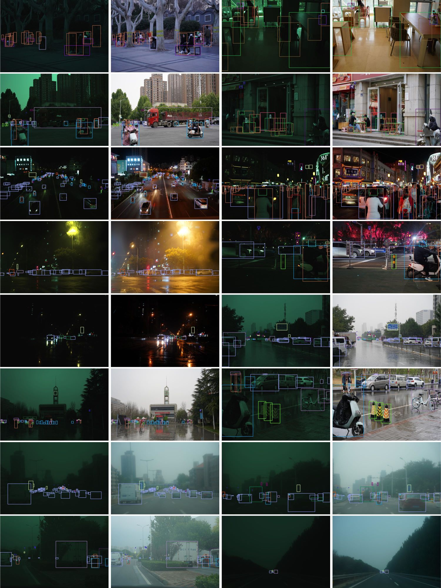

# [CVPR 2025 Highlight] AODRaw: Towards RAW Object Detection in Diverse Conditions

[Paper link](https://arxiv.org/abs/2411.15678)


| *RAW and corresponding sRGB images from different conditions* |
|:--:| 
|  | 

## Table of Contents

- [Introduction](#introduction)
- [Apps and Sourcecode](#apps-and-sourcecode)
- [Dataset and Downloading](#dataset-and-downloading)
    - [Down-sampling preprocessing](#down-sampling-preprocessing)
    - [Slicing preprocessing](#slicing-preprocessing)
- [Dataset Information](#dataset-information)
    - [Images](#images)
    - [Annotations](#annotations)
- [Citation](#citation)
- [License](#license)


## Introduction

Existing object detection methods often consider sRGB input, which was compressed from RAW data using ISP originally designed for visualization. However, such compression might lose crucial information for detection, especially under complex light and weather conditions. We introduce the AODRaw dataset, which offers 7,785 high-resolution real RAW images with 135,601 annotated instances spanning 62 categories, capturing a broad range of indoor and outdoor scenes under 9 distinct light and weather conditions. Based on AODRaw that supports RAW and sRGB object detection, we provide a comprehensive benchmark for evaluating current detection methods. We find that sRGB pre-training constrains the potential of RAW object detection due to the domain gap between sRGB and RAW, prompting us to directly pre-train on the RAW domain. However, it is harder for RAW pre-training to learn rich representations than sRGB pre-training due to the camera noise. To assist RAW pre-training, we distill the knowledge from an off-the-shelf model pre-trained on the sRGB domain. As a result, we achieve substantial improvements under diverse and adverse conditions without relying on extra pre-processing modules. 


## Apps and Sourcecode

- RAW Object Detection: [Our modified mmdetection]()
- Real-time RAW Object Detection: TODO


## Dataset and Downloading

Organize the dataset into the following directory structure. These directories are not always needed. **We can selectively store a directory according to the needs of our tasks.**

```
├── AODRaw
    ├── images (435G)
        ├── 00000000.ARW # RAW images
        ├── 00000000.JPG # sRGB images
        ├── ...
        ├── 00007784.ARW
        ├── 00007784.JPG
    ├── images_downsampled_raw (223G) # uses train/test_annotations_downsample_scale3_bbox_min_size32.json
    ├── images_downsampled_srgb (4.3G) # uses train/test_annotations_downsample_scale3_bbox_min_size32.json
    ├── images_slice_raw (439G) # uses train/test_annotations_slice_1280_300.json
    ├── images_slice_srgb (23G) # uses train/test_annotations_slice_1280_300.json
    ├── annotations        
        ├── train_annotations.json
        ├── test_annotations.json
        ├── train_annotations_downsample_scale3_bbox_min_size32.json
        ├── test_annotations_downsample_scale3_bbox_min_size32.json
        ├── train_annotations_slice_1280_300.json
        ├── test_annotations_slice_1280_300.json
```

These directories support **RAW-based object detection and sRGB-based object detection**.
|           Directory          |         Usage         | Resolution | Images | Downloads Baidu | Downloads Google | Downloads TeraBox |
|  ---------------------  | -------------------- |-------------------- |-------------------- |:--------------------:|:--------------------:|:--------------------:|
| `images` | original RAW and sRGB images | $6000\times 4000$ | 7,785 | [Images](https://pan.baidu.com/s/1WqPZz_E9godci3FHlx07EQ?pwd=i2dv) | | [Images](https://terabox.com/s/1QMnQ7z0V9Wy79pBylG5ZBw)|
| `images_downsampled_raw`       |       down-sampled RAW images  |    $2000\times 1333$    | 7,785       | [Images](https://pan.baidu.com/s/1QvqKuBPIgWXzdoABo-L-MQ?pwd=5v4a) |
| `images_downsampled_srgb`   |       down-sampled sRGB images |   $2000\times 1333$  | 7,785   | [Images](https://pan.baidu.com/s/1_56k-Tr1JGDI99xFugPGtQ?pwd=aerr) | | [Images](https://terabox.com/s/1QerBpH6FaGCE05cXks2XxQ) |
| `images_slice_raw`       |        sliced RAW images   | $1280\times 1280$   | 71,782 |
| `images_slice_srgb`   |         sliced sRGB images   |   $1280\times 1280$   | 71,782    | [Images](https://pan.baidu.com/s/1BwKE9idUTLiw8Hi_PYnL1Q?pwd=n4cu) | | [Images](https://terabox.com/s/1FOtFtFbRbmghYsCCodqwUg) |
| `annotations` | annotations | - | - | [Anno](https://pan.baidu.com/s/1dTPdAyONrgo5uzedAzdBLw?pwd=1t95) | [Anno](https://drive.google.com/file/d/1VEm1TRur7UgjzzEB2vx1kApC1xvceMzS/view?usp=sharing) |  [Anno](https://terabox.com/s/1_shu40gxKZl3XMN99SF2YQ)   | 

Among these directories, 
the `images` directory contains the original images in AODRaw, where 
most of the images are captured in a resolution of $6000\times 4000$. To feed these images into detectors, we preprocess the images in two ways. 
The `images_slice_raw` and `images_slice_srgb` are generated by [Slicing](#slicing-preprocessing). 
The `images_downsampled_raw` and `images_downsampled_srgb` are generated by [Down-sampling](#down-sampling-preprocessing). 

You can download these directories using the links above or generate them from the `images` directory as follows. If you want to preprocess images using different settings from our default setting, you should also generate corresponding annotation files.

### Down-sampling preprocessing

Down-sampling images for RAW-based object detection:
```shell
python downsample/downsample_raw_images.py \
--root [path to your AODRaw images, e.g., /AODRaw/images] \
--target [the path to save downsampled images, e.g., /AODRaw/images_downsample_raw] \
--cuda [optional, processing RAW images in a GPU]
```

Down-sampling images for sRGB-based object detection:
```shell
python downsample/downsample_srgb_images.py \
--root [path to your AODRaw images, e.g., /AODRaw/images] \
--target [the path to save downsampled images, e.g., /AODRaw/images_downsample_srgb]
```

### Slicing preprocessing

Slicing RAW images into $1280\times 1280$ patches for RAW-based object detection and generating the annotation file:
```shell
python slice/slice_raw_images.py --base-json slice/configs/slice_raw_train_images.json
python slice/slice_raw_images.py --base-json slice/configs/slice_raw_test_images.json
```

Slicing sRGB images into $1280\times 1280$ patches for sRGB-based object detection and generating the annotation file:
```shell
python slice/slice_srgb_images.py --base-json slice/configs/slice_srgb_train_images.json
python slice/slice_srgb_images.py --base-json slice/configs/slice_srgb_test_images.json
```

We can modify the config files to specify the path. `save_ann_file` and `save_dir` mean the save path for images and annotation files. The annotation files will be generated at `save_ann_file` if `save_ann_file` is not empty. We set `save_ann_file` as empty by default because 
we have provided the downloading links of the annotation files as above.

```json
{
  "img_root": "/AODRaw/images/", 
  "save_dir": "/AODRaw/images_slice_raw",
  "save_ann_file": ""
}
```


## Dataset Information

### Images

|  Split | Category |  Images  | Instances |
| ------ |----------| -------- |  -------  |
| Train  |    62    |  5,445   |  94,949  |
| Test   |    62    |  2,340  |   40,652  |

### Annotations

We provide annotations following the COCO format, as follows. The `tag` item shows the light and weather conditions in an image.

```json
{
  "images": [
    {
      "id": 0,
      "file_name": "00001336.ARW",
      "height": 6000, 
      "width": 4000, 
      "tag": [
          "low_light" 
      ]
    },
  ], 
  "type": "instance",
  "categories": [
    {
      "supercategory": "none",
      "id": 0,
      "name": "person"
    },
  ], 
  "annotations": [
    {
      "segmentation": [],
      "area": 4686,
      "ignore": 0,
      "iscrowd": 0,
      "image_id": 0,
      "bbox": [],
      "category_id": 0,
      "id": 0
    },
  ]
}
```

## Citation
```
@article{li2024aodraw,
  title={Towards RAW Object Detection in Diverse Conditions}, 
  author={Zhong-Yu Li and Xin Jin and Boyuan Sun and Chun-Le Guo and Ming-Ming Cheng},
  journal={arXiv preprint arXiv:2411.15678},
  year={2024},
}
```

## License

The code is released under the [Creative Commons Attribution-NonCommercial-ShareAlike 4.0 International Public License](https://creativecommons.org/licenses/by-nc-sa/4.0/legalcode) for NonCommercial use only.
